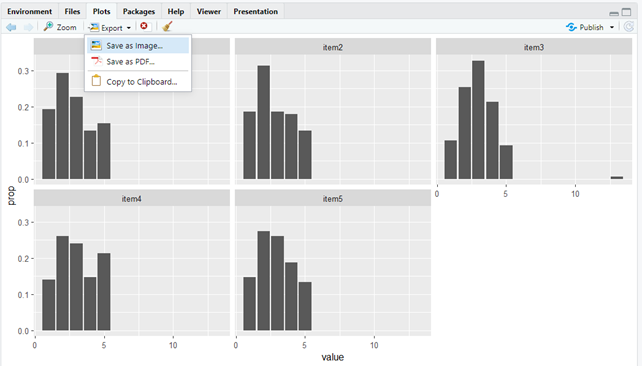

```{r setup, include=FALSE}
library(knitr)
knitr::opts_chunk$set(echo = TRUE, 
                      eval = TRUE, 
                      message = FALSE, 
                      comment="", 
                      tidy=FALSE, 
                      warning = FALSE, 
                      fig.align = "center", 
                      out.width = "70%")


library(ggplot2)
library(gridExtra)
library(tidyverse)
# hook_output <- knitr::knit_hooks$get("output")
# knitr::knit_hooks$set(output = function(x, options) {
# if (!is.null(n <- options$out.lines)) {
# x <- xfun::split_lines(x)
# if (length(x) > n) {
# # truncate the output
# x <- c(head(x, n), "....\n")
# } 
# x <- paste(x, collapse = "\n")
# } 
# hook_output(x, options)
# })

library(knitr)
hook_output = knit_hooks$get('output')
knit_hooks$set(output = function(x, options) {
  # this hook is used only when the linewidth option is not NULL
  if (!is.null(n <- options$myline)) {
    x = xfun::split_lines(x)
    # any lines wider than n should be wrapped
    if (any(nchar(x) > n)) x = strwrap(x, width = n)
    x = paste(x, collapse = '\n')
  } else if (!is.null(n <- options$out.lines)) {
x <- xfun::split_lines(x)
if (length(x) > n) {
# truncate the output
x <- c(head(x, n), "....\n")
}
x <- paste(x, collapse = "\n")
}
  hook_output(x, options)
})
set.seed(9999)
library(knitr)
library(faux)

babies = rnorm_multi(n = 10, 
                     varnames = c("genere", "peso", "altezza"),
                     mu = c(0, 8, 80), 
                     sd = c(1, 4, 10), 
                     r = c(.30, .50, .80), 
                     empirical = F)
babies$id = paste("baby", 1:nrow(babies), sep ="")
babies = babies[, c("id", "genere", "peso", "altezza")]
babies$genere = norm2likert(babies$genere, 
                            prob = c(.50, .50), 
                            labels = c("m", "f"))
babies$peso = norm2gamma(babies$peso, 
                         10, 1)


dataTol <- rnorm_multi(n = 100, 
                  mu = c(0, 20, 20),
                  sd = c(1, 5, 5),
                  r = c(0.5, 0.5, 0.8), 
                  varnames = c("A", "B", "C"),
                  empirical = FALSE)
dataTol$A = (norm2likert(dataTol$A, c(.17, .17, .17, .17, .17, .17)))
dataTol$B = norm2binom(dataTol$B, size = 1, prob = .90)
dataTol$C = norm2gamma(dataTol$C, shape = 2, rate = 4)

# prendo la correlazione dei dati Tol che ho e simulo dei dati nuovi a partire da quelli 

my_data = rnorm_multi(n = 100, 
                      mu = c(10, 1000, 5), 
                      sd = c(4, 500, 1), 
                      r = c(.80, .30, 0.0), 
                      varnames = c("benessere", "stipendio", "genere"))
my_data$benessere = norm2pois(my_data$benessere, 
                              5)
my_data$stipendio = norm2trunc(my_data$stipendio, 
                               min = 300)
my_data$genere = norm2likert(my_data$genere, prob = c(.49, .51), 
                             labels = c("m", "f"))
```


## Table of contents {.plain}

\tableofcontents


##


```{r echo = F}
benessere = read.csv("data/benessereScores.csv", 
                     sep = ",", header = TRUE)
```


- Grafici base
- Grid graphics \& `ggplot2`

Entrambi: 

- High level functions $\rightarrow$ le funzioni che producono effettivamente il grafico
- Low level functions $\rightarrow$ Le funzioni che lo rendono più "bello"

# Grafici tradizionali

## High level functions


```{r eval = FALSE}
plot()      # scatter plot, specialized plot methods
boxplot()
hist()      # histogram
qqnorm()    # quantile-quantile plot
barplot()
pie()       # pie chart
pairs()     # scatter plot matrix
persp()     # 3d plot
contour()   # contour plot
coplot()    # conditional plot
interaction.plot()
```


`demo(graphics)` vi fornisce un tour guidato dei grafici

## Low level functions


```{r eval = FALSE}
points()  # Aggiunge punti al grafico
lines()   # Aggiunge linee  al grafico 
rect()
polygon()
abline() # aggiunge una riga con intercetta a e pendenza b
arrows() # aggiunge barre d'errore     
text()   # aggiunge testo nel plot
mtext()  # aggiunge testo nei margini
axis()   # personalizza gli assi
box()    # box attorno al grafico 
legend() # cambia parametri della legenda
```

## Plot layout

Ogni plot è composto da due regioni:

- Plotting region (dove effettivamente sta il plot)
- La regione dei margini (contiene i margini e le varie etichette degli assi)

\pause

\small

Uno scatter plot: 

```{r eval = FALSE}
x <- runif(50, 0, 2) # 50 numeri random 
y <- runif(50, 0, 2) # da una distr. uniforme
plot(x, y, main="Titolo", 
     sub="Sottotitolo", xlab="x-label",
     ylab="y-label") # ecco il plot
```

Aggiunge del testo al plot


```{r eval = FALSE}
text(0.6, 0.6, "Testo @ (0.6, 0.6)")
abline(h=.6, v=.6, lty=2) # linee h. e v.
```

## Margins region 

\small

```{r eval=TRUE, echo=FALSE, out.width="100%"}
x <- runif(50, 0, 2) # 50 uniform random numbers
y <- runif(50, 0, 2)
plot(x, y, main="Title", 
     sub="Subtitle", xlab="x-label",
     ylab="y-label", cex.lab=1.5) # produce plotting window
text(0.6, 0.6, "Text at (0.6, 0.6)")
abline(h=.6, v=.6, lty=2) # horiz. and vert. lines

for(side in 1:4) mtext(-1:4, side=side, at=.7, line=-1:4)
mtext(paste("Side", 1:4), side=1:4, line=-1, font=2)
```


## Modificare il layout dei plot 

Vanno creati dei pannelli

\small

```{r eval=FALSE, myline = 60}
par(mfrow=c(nrighe, ncolonne)) # pannelli vengono riempiti per riga
par(mfcol=c(nrighe, ncolonne)) # pannelli vengono riempiti per colonna 
```

## `plot()`

```{r eval = FALSE}
plot(x) # solo una variabile
plot(x, y) # due variabile (scatter plot)
plot(y ~ x) # due variabile, y in funzione di x
```


## Esempi: `plot(x)`

\scriptsize

```{r}
with(benessere, 
     plot(score_au, 
          col = ifelse(genere == 1, "blue", "pink"), 
          pch = ifelse(genere == 1, 3, 16)))
legend(x = 115, y = 48, 
       c("Maschi", "Femmine"), pch = c(3, 16), 
       col =c("blue", "pink"), cex = 2)
```


## Esempi: `plot(x, y)`

```{r}
with(benessere, 
     plot(score_au, score_ben))

```

## Esempi: `plot(y ~ x)`

```{r}
with(benessere, 
     plot(score_ben ~ score_au))
```


## Esempi: `plot(y ~ x)` con retta di regressione

```{r}
with(benessere, 
     plot(score_ben ~ score_au))
abline(lm(score_ben ~ score_au, data = benessere), 
          col = "blue", lty = 3, lwd = 3)
```


## Esempi: `plot(y ~ x)` con x categoriale

```{r}
benessere$genere <- factor(ifelse(benessere$genere == 1, 
                           "maschio", "femmina"))
plot(score_au ~ genere, data = benessere)

```

## Attenzione!

`plot(y ~ x)` con x categoriale è uguale a `boxplot(y ~ x)`


```{r}
boxplot(score_au ~ genere, data = benessere)
```


## `hist()`: Frequenze

\scriptsize
```{r}
hist(benessere$score_au, breaks = 20)
```


## `hist()`: Densità

Densità
\scriptsize
```{r}
hist(benessere$score_au,
     density=50, breaks=20, 
     prob=TRUE, col = "darkblue")
```


## Multi plot (in riga)

\footnotesize

```{r eval = FALSE}
par(mfrow=c(1, 2))

hist(benessere$score_au,density=50, breaks=20, prob=TRUE, 
     main = "Score au")
curve(dnorm(x, mean=mean(benessere$score_au), 
            sd=sd(benessere$score_au)), 
      col="springgreen4", lwd=2, add=TRUE, yaxt="n")

[...]

```


```{r echo = FALSE}
par(mfrow=c(2, 2))

hist(benessere$score_au,density=50, breaks=20, prob=TRUE, 
     main = "Score au")
curve(dnorm(x, mean=mean(benessere$score_au), 
            sd=sd(benessere$score_au)), 
      col="springgreen4", lwd=2, add=TRUE, yaxt="n")

hist(benessere$score_ben,density=50, breaks=20, prob=TRUE, 
     main = "Score benessere")
curve(dnorm(x, mean=mean(benessere$score_ben), 
            sd=sd(benessere$score_ben)), 
      col="royalblue", lwd=2, add=TRUE, yaxt="n")

```


## Multiplot (in colonna)


```{r echo = FALSE, out.width="120%"}
par(mfcol= c(2,2))
hist(benessere$score_au,density=50, breaks=20, prob=TRUE, 
     main = "Score au")
curve(dnorm(x, mean=mean(benessere$score_au), 
            sd=sd(benessere$score_au)), 
      col="springgreen4", lwd=2, add=TRUE, yaxt="n")

hist(benessere$score_ben,density=50, breaks=20, prob=TRUE, 
     main = "Score benessere")
curve(dnorm(x, mean=mean(benessere$score_ben), 
            sd=sd(benessere$score_ben)), 
      col="royalblue", lwd=2, add=TRUE, yaxt="n")

with(benessere, 
     plot(score_au, score_ben, frame = FALSE))


with(benessere, 
     plot(score_au, score_ben, frame = FALSE))
abline(lm(score_ben ~ score_au, data = benessere), col = "blue", lwd = 2)


```


## Multiplot (in colonna), codice


```{r echo = T, eval = FALSE}
par(mfcol= c(2,2))
hist(benessere$score_au,density=50, breaks=20, prob=TRUE, 
     main = "Score au")
curve(dnorm(x, mean=mean(benessere$score_au), 
            sd=sd(benessere$score_au)), 
      col="springgreen4", lwd=2, add=TRUE, yaxt="n")

hist(benessere$score_ben,density=50, breaks=20, prob=TRUE, 
     main = "Score benessere")
curve(dnorm(x, mean=mean(benessere$score_ben), 
            sd=sd(benessere$score_ben)), 
      col="royalblue", lwd=2, add=TRUE, yaxt="n")

with(benessere, 
     plot(score_au, score_ben, frame = FALSE))


with(benessere, 
     plot(score_au, score_ben, frame = FALSE))
abline(lm(score_ben ~ score_au, data = benessere), col = "blue", lwd = 2)


```

## `barplot()`: Frequenze assolute

Per creare i grafici a barre quando si hanno variabili discrete o categoriali

 


```{r}
freq_item1 = table(benessere$item1)
barplot(freq_item1, 
        main = "Frequenze assolute di risposta all'item 1")

```

## `barplot()`: Frequenze relative

Richiede uno step in più $\rightarrow$ la creazione della tabella delle frequenze

```{r}
perc_item1 = freq_item1/sum(freq_item1)
barplot(perc_item1, ylim = c(0, 1), 
        main = "Frequenze relative di risposta all'item 1")

```


## `barplot()` con più variabili 

\scriptsize

```{r}
perc_item1_gender = table(benessere$genere, benessere$item1)
perc_item1_gender[1,] = perc_item1_gender[1,]/table(benessere$item1)
perc_item1_gender[2,] = perc_item1_gender[2,]/table(benessere$item1)

barplot(perc_item1_gender, ylim=c(0,1), 
        legend = rownames(perc_item1_gender))
abline(h = .5, lty = 2, col = "red")
```


## Un altro esempio di multiplot 

```{r echo = FALSE, out.width="100%"}
item_ben = benessere[, grep("item", colnames(benessere))]

par(mfrow = c(2, round(ncol(item_ben)/2  + 0.2)))
temp = NULL
for (i in 1:ncol(item_ben)) {
  temp = table(benessere$genere, item_ben[,i])
  for (j in 1:nrow(temp)) {
    temp[j,] = temp[j,]/table(item_ben[,i])
  }
barplot(temp, ylim=c(0,1), legend = rownames(temp), 
        main = colnames(item_ben)[i])
abline(h = .5, lty = 2, col = "red")
}

```


## Un esempio di multiplot (codice) 
\footnotesize

```{r echo = TRUE, eval = FALSE, myline = 80}
item_ben = benessere[, grep("item", colnames(benessere))]

par(mfrow = c(2, round(ncol(item_ben)/2  + 0.2)))
temp = NULL
for (i in 1:ncol(item_ben)) {
  temp = table(benessere$genere, item_ben[,i])
  for (j in 1:nrow(temp)) {
    temp[j,] = temp[j,]/table(item_ben[,i])
  }
barplot(temp, ylim=c(0,1), legend = rownames(temp), 
        main = colnames(item_ben)[i])
abline(h = .5, lty = 2, col = "red")
}

```


## `interaction.plot()`

Permette di vedere l'interazione tra due variabili a seconda di una terza variabile: 

`interaction.plot(x, v. categoriale, y)`

\pause

La relazione tra peso e altezza cambia a seconda del genere?


```{r echo = FALSE}
babies = read.table("data/babies.tab")

plot(altezza ~ peso, data = babies, 
     col = ifelse(genere == "f", "pink", "blue"), 
     pch = 16, main = "Peso - altezza dei bambini", 
     cex = 3)
```


## 
\footnotesize

```{r tidy=FALSE, out.lines = 8}
babies$cat_weight = with(babies, 
                         ifelse(
                           peso <= quantile(babies$peso)[2], 
                           "light", 
                           ifelse(peso > quantile(babies$peso)[2] & 
                                    peso > quantile(babies$peso)[4], 
       "medium", 
       "heavy")))
babies$cat_weight = factor(babies$cat_weight, 
                           levels = c("light", 
                                      "medium", 
                                      "heavy"))


babies
```

## 

```{r}
with(babies, 
     interaction.plot(cat_weight, genere, altezza))

```


# `ggplot2`

## 

è più difficile ma è anche più facile: 

```{r eval = FALSE}

ggplot(dati, 
       ars(x = variabile.x, 
           y = variabile.y, 
           col = variabile.colore.contorno, 
           fill =  variabile.colore.filling, 
           shape =  variabile.shape, 
           size = variabile.size, 
           ...)) + geom_tipo.grafico() + ...

```

Solitamente vuole i dati in formato long

## Scatter plot 
\small

```{r}
ggplot(benessere, 
       aes(x = score_au, y = score_ben, 
           col = genere, 
           shape = genere)) + 
  geom_point(size = 3)
```

## Scatter plot con retta di regressione 

```{r}
ggplot(benessere, 
       aes(x = score_au, y = score_ben)) + 
  geom_point(size = 3) + 
  geom_smooth(method = "lm", formula = y ~ x) + theme_light()
```


## `boxplot()` e `violinplot()`

Sono i grafici prediletti per far vedere le distribuzioni dei dati (specie il violin)

Richiedono che i dati siano in formato long: 


```{r echo = FALSE}
data.frame(id = rep(paste0("sbj", 1:3), each = 2), 
           condition = rep(c("A", "B"),  length.out = 6), 
           mean_time = rgamma(6, 10, 3))

```


## 

```{r}
small = benessere[, c("ID", "score_au", "score_ben")]
score_long  = reshape(small, 
        idvar = "ID", 
        times =names(small)[-1], 
        timevar = "score", v.names = "value",
        varying = list(names(small)[-1]), 
        direction = "long")
head(score_long)
```

## boxplot vs violinplot

::: columns

:::: column

Boxplot
\scriptsize

```{r myline = 60}
ggplot(score_long, 
       aes(x = score, y = value,
           fill = score)) + 
  geom_boxplot()
```


::::

:::: column

Violinplot

\scriptsize

```{r myline =60}
ggplot(score_long, 
       aes(x = score, y = value,
           fill = score)) + 
  geom_violin(trim = FALSE) 
```


::::

:::

##

\footnotesize

```{r}

score_long = merge(score_long, benessere[, c("ID", "genere")])

ggplot(score_long, 
       aes(x = score, y = value,
           fill = genere)) + geom_violin(trim = FALSE) 
```

## barplot e istogrammi

`geom_hist()`: istogramma (per variabili continue)

`geom_bar()`: grafico a barre 

Prevede degli argomenti: 

- `geom_bar(stat = "count")`: conta in automatico le frequenze per ogni modalità del carattere, **non vuole una variabile y**

- `geom_bar(stat = "identity")`: plotta un valore associato ad ogni modalità del carattere, **vuole una variabile y**


## `geom_bar(stat = "count")`:

```{r}
ggplot(benessere, 
       aes(x = item5)) + geom_bar(stat = "count")
```


## `geom_bar(stat = "identity")`

Vanno prima calcolati i valori per ogni modalità del carattere (e.g., proporzioni o percentuali): 

\footnotesize
```{r out.width="45%"}
item_5 = data.frame(table(benessere$item5)/nrow(benessere))
item_5


```

## Poi arriva il grafico

```{r}
ggplot(item_5, 
       aes(x = Var1, y = Freq)) + geom_bar(stat = "identity")

```


## Anche tutti insieme!

Creo il dataset in formato long dei miei dati

\footnotesize
```{r out.lines = 6}
new_item = benessere[, c(grep("ID", colnames(benessere)), 
                        grep("item", colnames(benessere)))]
new_item = reshape(new_item, 
        idvar = "ID", 
        times =names(new_item)[-1], 
        timevar = "item", v.names = "value",
        varying = list(names(new_item)[-1]), 
        direction = "long")
new_item

```

## Calcolo le proporzioni

Di ogni opzione di risposta `value` per ogni item `item`

```{r out.lines = 6}
proporzione = new_item %>% 
  group_by(item, value) %>% 
  summarise(prop = n()/nrow(benessere))

proporzione
```


## Finalmente plotto

```{r}
ggplot(proporzione, 
       aes(x = value, y = prop)) + 
  geom_bar(stat = "identity") + 
  facet_wrap(~item) # mi crea i pannelli

```


# Esportare i grafici

## In automnatico


```{r eval = F}
pdf("nome_grafico.pdf")
png("nome_grafico.png")          
tiff("nome_grafico.tiff")
jpeg("nome_grafico.jpeg")
bmp("nome_grafico.bmp")
```

Dopo che si è esportato il grafico:

```{r eval=FALSE}
dev.off()
```

## Esempio

```{r eval=FALSE}
pdf("il_mio_violin.pdf")
ggplot(score_long, 
       aes(x = score, y = value,
           fill = score)) + geom_violin(trim = FALSE) 
dev.off()
```


## A mano


```{r eval = FALSE, out.width="120%"}

```


